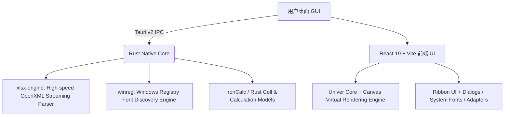

# DawnGrid

<div align="center">

**极速、现代、原生的桌面级智能电子表格工作台**  
*A Blazing-Fast, Native Desktop Spreadsheet Powered by Tauri v2, Rust xlsx-engine & Univer*

[](https://tauri.app/)
[](https://www.rust-lang.org/)
[](https://react.dev/)
[](https://univer.ai/)
[](LICENSE)

</div>

---

## 🌟 项目简介 (Overview)

**DawnGrid** 是一款基于 **Tauri v2** + **Rust 底层解析引擎** + **Univer 现代画布渲染引擎** 构建的新一代高性能桌面电子表格应用。

传统办公套件启动迟缓、内存占用过高且对超大表格响应迟钝；而单纯的纯前端网页表格在文件 IO 与系统集成上受限。DawnGrid 融合了 Rust 原生级别的解析速度、亚秒级文件加载、现代化的 Ribbon 功能区交互与系统级字体渲染，同时内嵌 **DawnAI** 智能助理，专为追求极致流畅体验与现代审美的数据工作者打造。

---

## ✨ 核心特性 (Key Highlights)

- ⚡ **原生级极速启动与解析**：采用自研 Rust `xlsx-engine` 高性能流式解析内核，告别几百兆甚至 GB 级的内存开销，亚秒级打开数十万单元格的复杂 `.xlsx` 表格。
- 🎨 **100% 深度像素级 Ribbon 工作台**：精心调优的 7 大功能卡片、定高无缝几何盒模型、支持鼠标滚轮横向丝滑滑动与防溢出左右滚动导航。
- 🔤 **Windows 全系统字体枚举**：原生注册表级字体扫描，自动识别系统中英文字体族并分组置顶（微软雅黑、苹方、等线、楷体、宋体等）。
- 📑 **多工作表智能分块与秒级切换**：支持工作表数据静默预拉取（Background Prefetch）与自适应越界裁剪，切换 Sheet 页签零延迟。
- 🤖 **DawnAI 原生智能助理**：内置专属 AI 面板，一键执行公式辅助生成、表格异常校验与数据趋势智能洞察。
- 📂 **原生文件系统深度集成**：支持原生文件选择器、直接将 `.xlsx` / `.xlsm` 拖拽进窗口秒开、多格式导出保存。

---

## 📋 详细功能清单 (Comprehensive Feature Matrix)

### 1. 开始 (Home Tab)
- **DawnAI 智能卡片**：
  - `DawnAI`：自然语言表格助手对话窗口，支持数据提问与公式推荐。
  - `AI 校验`：一键扫描表格中的潜在格式错误、空值与异常值。
  - `AI 分析`：智能总结所选数据区域的核心趋势与分布概况。
- **剪贴板 (Clipboard)**：
  - 智能粘贴（完整粘贴、仅粘贴数值、仅粘贴公式、仅粘贴格式、仅粘贴列宽、粘贴除边框外内容）。
  - 剪切 (Ctrl+X)、复制 (Ctrl+C)、格式刷 (Format Painter)。
- **字体与字形 (Font & Typography)**：
  - Windows 系统已安装字体全量枚举选择器（支持中文字体别名识别与分组）。
  - 字号精确调节（8pt ~ 72pt）及快捷放大 / 缩小。
  - 加粗 (Bold)、倾斜 (Italic)、下划线 (Underline)、删除线 (Strikethrough)。
  - 丰富边框设置（下框线、上框线、外侧框线、粗边框、所有框线、双下框线等）。
  - 单元格填充背景色拾取器（支持快捷置空/清除填充）。
  - 字体文本颜色拾取器。
- **对齐与排版 (Alignment)**：
  - 垂直对齐：顶端对齐、垂直居中、底端对齐。
  - 水平对齐：左对齐、居中对齐、右对齐、两端对齐。
  - 缩进调节：增加缩进量、减少缩进量。
  - 文字方向旋转（逆时针、顺时针、竖排文本）。
  - 自动换行 (Wrap Text)。
  - 合并单元格系列（合并居中、跨越合并、合并单元格、取消合并）。
- **数字格式 (Number Formats)**：
  - 快捷格式下拉框：常规、数字、货币、会计专用、短日期、长日期、时间、百分比、分数、科学记数、文本。
  - 快速货币样式、百分比样式、千位分隔符样式。
  - 增加小数位数、减少小数位数。
- **样式 (Styles)**：
  - 条件格式：突出显示单元格规则、前后规则、数据条、色阶、管理规则。
  - 表格样式：套用浅色 / 中度 / 深色表格设计。
- **单元格操作 (Cells)**：
  - 快捷插入：插入单元格、工作表行、工作表列、新工作表。
  - 快捷删除：删除单元格、删除行、删除列、删除工作表。
  - 行列尺寸：自定义行高、自动调整行高、自定义列宽、自动调整列宽、隐藏与取消隐藏行/列。
- **编辑与快捷处理 (Editing)**：
  - 自动求和（求和 SUM、平均值 AVERAGE、计数 COUNT、最大值 MAX、最小值 MIN）。
  - 快速填充：向下填充、向右填充。
  - 清除菜单：全部清除、清除格式、清除内容、清除批注。
  - 排序与筛选：升序、降序、自定义多级排序、智能自动筛选、重新应用筛选。
  - 查找与选择：查找、替换、转到 (Go To)、定位条件。

---

### 2. 插入 (Insert Tab)
- **数据透视表 (Pivot Table)**：
  - 专属数据透视表向导弹窗。
  - 字段列表拖拽映射（行字段、列字段、值汇总、筛选字段）。
  - 多种聚合计算方式（求和、计数、平均值、极值等）。
- **智能数据表格 (Table)**：
  - 将所选连续区域快速声明为规范结构化数据表。
- **推荐的图表 (Charts)**：
  - 推荐图表向导弹窗：柱形图 (Column)、折线图 (Line)、饼图 (Pie)、条形图 (Bar)、面积图 (Area)、散点图 (Scatter)。
  - 图表类型预览与一键画布嵌入。
- **迷你图 (Sparklines)**：
  - 单元格内嵌微型图：折线、柱形、盈亏图。
- **链接与批注 (Links & Notes)**：
  - 插入网页或工作簿内部超链接。
  - 单元格富文本批注与备注创建。
- **特殊符号 (Symbols)**：
  - 分类特殊字符拾取弹窗（货币符号、数学运算符、箭头、几何制表符等）。

---

### 3. 页面布局 (Page Layout Tab)
- **页面设置 (Page Setup)**：
  - 页边距快捷预设（常规、宽、窄）。
  - 纸张方向切换（纵向 Portrait / 横向 Landscape）。
  - 纸张尺寸规范（A4、Letter、Legal、A3 等）。
  - 打印区域：设置打印区域、清除打印区域。
  - 分页符管理：插入分页符、删除分页符、重置所有分页符。
- **页眉与页脚 (Header & Footer)**：
  - 可视化页眉页脚配置面板。
  - 支持左/中/右三栏布局与动态页码（`&[页码]` / `&[总页数]`）占位符。
- **工作表视图选项 (Sheet Options)**：
  - 屏幕网格线显隐开关、打印网格线开关。
  - 屏幕行号列标显隐开关、打印标题行列开关。

---

### 4. 公式 (Formulas Tab)
- **函数库 (Function Library)**：
  - 专属「插入函数」引导弹窗，支持分类查找与参数填写。
  - 类别覆盖：财务、逻辑、文本、日期与时间、查找与引用、数学与三角函数。
- **已定义名称 (Defined Names)**：
  - **名称管理器 (Name Manager)**：统一管理工作簿及工作表级别的命名范围，支持新建、编辑、引用位置校验。
  - 根据所选内容自动创建名称。
- **公式审核 (Auditing)**：
  - 显示公式开关（在单元格计算结果与底层公式字符串间秒切）。
  - 追踪引用单元格、追踪从属单元格、移除追踪箭头。
  - 错误检查向导。
- **计算模式 (Calculation Options)**：
  - 自动计算 / 手动计算模式切换。
  - 立即重算工作簿、立即计算当前工作表。

---

### 5. 数据 (Data Tab)
- **排序与高级筛选**：
  - 多级自定义排序面板（多列主次规则、升序降序独立控制）。
  - 高级筛选面板（支持复杂多条件区域筛选、不重复记录筛选、原地筛选或复制到新位置）。
- **数据工具 (Data Tools)**：
  - 数据分列向导（分隔符号与固定宽度支持）。
  - 快速填充与删除重复项。
  - **数据验证面板 (Data Validation)**：整数、小数、序列（下拉单选菜单）、日期、文本长度与自定义公式验证，包含输入提示与错误警告。
  - **单变量求解 (Goal Seek)**：目标单元格逆向逼近计算求解器。
  - **合并计算 (Consolidate)**：跨区域/跨工作表多引用源自动合并与函数统计。
- **分级显示 (Outline)**：
  - 分类汇总弹窗（自动按选定列插入分类小计与总计行）。
  - 行列分组创建与取消组合。

---

### 6. 审阅 (Review Tab)
- **安全与保护 (Protection)**：
  - **保护工作表**：防止非授权用户修改公式或内容，支持权限细分。
  - **允许用户编辑区域 (Allow Edit Ranges)**：为特定单元格区域配置独立密码或无锁编辑权限。
  - **保护工作簿**：锁定工作簿结构，防止随意新增、删除或重命名工作表。
- **统计信息 (Workbook Statistics)**：
  - 一键调取当前工作簿统计透视模态框（工作表数量、数据单元格总数、公式单元格数量、已用行列跨度）。

---

### 7. 视图 (View Tab)
- **工作簿视图**：普通视图、分页预览模式。
- **显示显隐控制**：网格线开关、标题行号列标开关、编辑栏 (Formula Bar) 开关、十字准星高亮指示线。
- **缩放与窗口管理**：
  - 100% 缩放复位、选定区域自适应放大。
  - **冻结窗格 (Freeze Panes)**：冻结首行、冻结首列、冻结至当前选区。

---

## 🛠️ 技术架构 (Architecture)



- **Runtime**: [Tauri v2](https://v2.tauri.app/)
- **Core Engine**: Rust (`xlsx-engine` sidecar, quick-xml, memchr)
- **Canvas Rendering**: [@univerjs/core](https://univer.ai/)
- **Frontend Stack**: React 19, TypeScript, Vite
- **Styling**: Pure Modern CSS (Zero Tailwind/CSS-in-JS bloat for native performance)

---

## 🚀 本地开发与构建 (Getting Started)

### 前置依赖
1. [Node.js](https://nodejs.org/) (v18+ 或 v20+)
2. [Rust 工具链](https://rustup.rs/) (Cargo & rustc)
3. Windows C++ Build Tools (针对 Windows 桌面平台编译)

### 安装与启动
```bash
# 1. 克隆代码仓库
git clone git@github.com:m66kkm/DawnGrid.git
cd DawnGrid

# 2. 安装前端依赖
npm install

# 3. 启动桌面开发环境 (同时拉起 Vite 与 Tauri 调试器)
npm run tauri dev
```

### 构建发布包 (Production Release)
```bash
npm run tauri build
```
编译产物将生成在 `src-tauri/target/release/` 下，包含免安装 `.exe` 与完整 MSI 安装程序。

---

## 📄 开源许可 (License)

本项目采用 [GNU Affero General Public License v3.0 (AGPL-3.0)](LICENSE) 开源协议。
